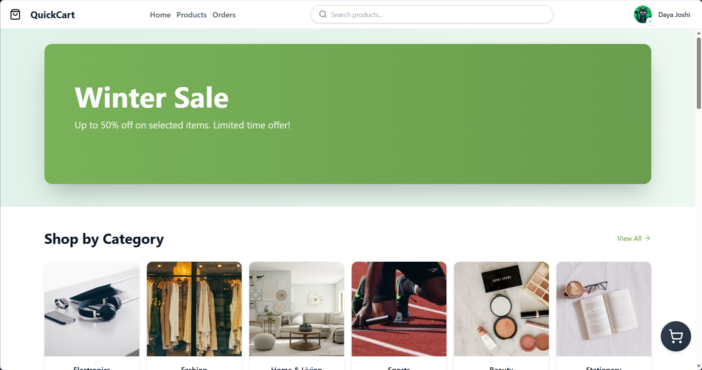

# QuickCart 🛒

A modern, full-stack e-commerce platform built with the MERN stack, featuring seamless buying and selling experiences with real-time order tracking.

[](https://quick-cart-pwhm.onrender.com/)
[](LICENSE)

## 📸 Screenshots

### Desktop View


### Mobile View


## ✨ Features

- **Dual Authentication** - Google OAuth & email-based login/signup
- **Multi-vendor Marketplace** - Users can switch to seller mode and list products
- **Smart Search** - Quick product discovery with search functionality
- **Shopping Cart** - Add products and manage orders seamlessly
- **Order Tracking** - Real-time order status updates for buyers and sellers
- **Admin Dashboard** - User management and platform oversight
- **Profile Management** - Complete user profiles with seller registration
- **Product Management** - Create, edit, and remove product listings
- **Category Browse** - Organized product categories for easy navigation
- **Fully Responsive** - Optimized for all devices and screen sizes
- **Help & Support** - Dedicated help page for user assistance

## 🛠️ Tech Stack

**Frontend:**
- React.js
- Tailwind CSS
- React Router

**Backend:**
- Node.js
- Express.js
- MongoDB
- JWT Authentication

**Additional:**
- Google OAuth 2.0
- RESTful API Architecture

## 🚀 Getting Started

### Prerequisites

- Node.js (v14 or higher)
- MongoDB
- Google OAuth credentials

## 📁 Project Structure
```
quickcart/
├── frontend/          # React frontend
│   ├── src/
│   ├── public/
│   └── package.json
├── backend/           # Express backend
│   ├── models/
│   ├── routes/
│   ├── controllers/
│   ├── middleware/
│   └── package.json
└── README.md
```

## 👤 User Roles

- **Buyer** - Browse, search, and purchase products
- **Seller** - List and manage products for sale
- **Admin** - Manage users and oversee platform operations

## 🔒 Security

- JWT-based authentication
- Password hashing with bcrypt
- Secure Google OAuth integration
- Protected API routes

## 📝 License

This project is licensed under the MIT License - see the [LICENSE](LICENSE) file for details.

## 🤝 Contributing

Contributions, issues, and feature requests are welcome! Feel free to check the [issues page](https://github.com/yourusername/quickcart/issues).

## 📧 Contact

Daya Joshi - dayajoshi1222@gmail.com

Project Link: [https://github.com/yourusername/quickcart](https://github.com/yourusername/quickcart)

---

⭐ Star this repo if you find it helpful!
